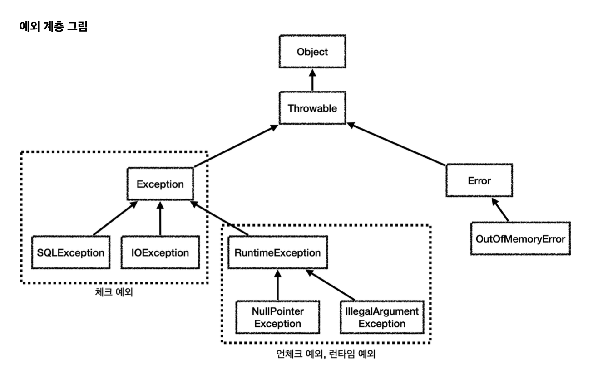

# 📌예외처리 구조

`Object` : 자바에서 기본형을 제외한 모든 것은 객체이다. 예외 또한 객체이다.\
모든 객체의 최상위 부모는 Object이므로 예외 객체 또한 최상위 부모는 Object이다.

`Throwable` : 최상위 예외이다. 하위에 Exception과 Error가 있다.

`Error` : 메모리 부족이나 심각한 시스템 오류와 같이 애플리케이션에서 복구가 불가능한 시스템 예외이다.\
애플리케이션 개발자는 이 예외를 잡으려고 해서는 안된다.

`Exception` : 체크 예외
- 애플리케이션 로직에서 사용할 수 있는 실질적인 최상위 예외이다.
- `Exception`과 그 하위 예외는 모두 컴파일러가 체크하는 체크예외이다.\
단 `RuntimeException`은 예외로 한다.

`RuntimeException` : 언체크 예외, 런타임 예외  
- 컴파일러가 체크하지 않는 언체크 예외이다.
- `RuntimeException`과 그 자식 예외는 모두 언체크 예외이다.
- `RuntimeException`의 이름을 따라서 `RuntimeException`과 그 하위 언체크 예외를\
**런타임 예외**라고 많이 부른다.

# 📌체크 예외 vs 언체크 예외(런타임 예외)
체크 예외는 발생한 예외를 개발자가 명시적으로 처리해야한다. 그렇지 않으면 컴파일 오류가 발생한다.\
언체크 예외는 개발자가 발생한 예외를 명시적으로 처리하지 않아도 된다.

**주의해야할 점**/
상속 관계에서 부모 타입은 자식을 담을 수 있는데, 이것은 예외 처리에서도 적용된다.\
상위 예외를 `catch`로 잡으면그 하위 예외까지 함께 잡는다.\
따라서 애플리케이션 로직에서는 `Throwable` 예외를 잡으면 안된다.\
왜냐하면 `Error` 예외도 함께 잡을 수 있기 때문이다.\
애플리케이션 로직은 `Exception`부터 필요한 예외로 생각하고 잡으면 된다.
